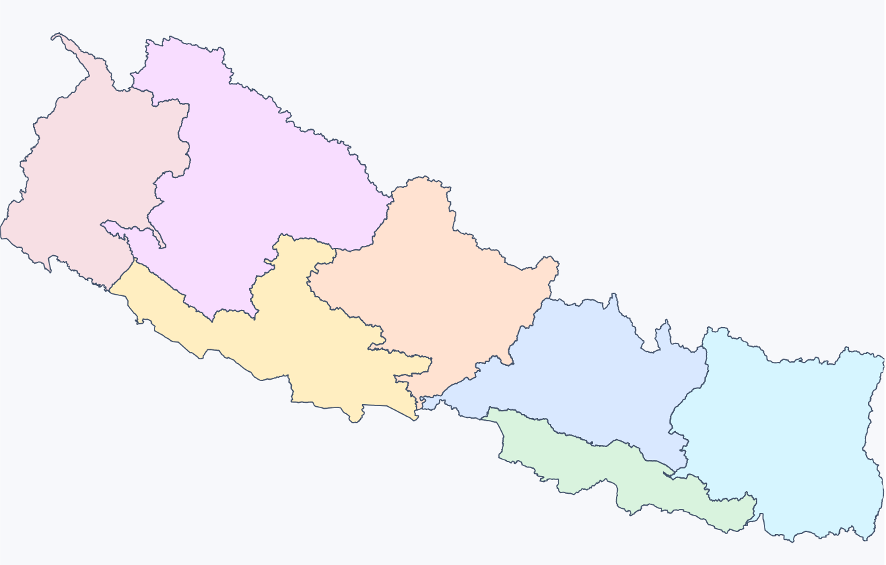

# Nepal Map Component

`nepal-map-component` is a React component for Nepal administrative boundaries with:

- Hierarchical drill navigation (`country -> province -> district -> local_unit -> ward`)
- Configurable region selection modes (`none | single | multi`)
- Typed region IDs and typed start-region helpers
- Smooth animated zoom (`viewBox`) and layer cross-fade transitions
- Policy-based region enable/disable and customization with your own colors
- Keyboard-accessible region interaction

This README is a complete usage guide for integrating and customizing the component.

[See worked out examples, configure and try out the component, generate code for your app based on your configuration in the playground.](https://bidwat.github.io/nepal-map-component-playground/)

<p align="center">
  
</p>

---

## Table of Contents

1. [Installation](#installation)
2. [Quick Start](#quick-start)
3. [Mental Model](#mental-model)
4. [Region IDs and Naming Rules](#region-ids-and-naming-rules)
5. [Catalog and Level Helpers](#catalog-and-level-helpers)
6. [Props Reference](#props-reference)
7. [Selection (Controlled and Uncontrolled)](#selection-controlled-and-uncontrolled)
8. [Policy and Theming](#policy-and-theming)
9. [Recipes](#recipes)
10. [Accessibility and Interaction Details](#accessibility-and-interaction-details)
11. [Troubleshooting and Validation Errors](#troubleshooting-and-validation-errors)
12. [Exports](#exports)
13. [Development Commands](#development-commands)

---

## Installation

Install from npm:

```bash
npm i nepal-map-component
```

For local development inside this repository:

```bash
cd nepal-map-component
npm install
```

---

## Quick Start

```tsx
import {
  getRegionReferenceById,
  NepalMap,
  VIEW_LEVEL,
} from "nepal-map-component";

export function NepalMapExample() {
  const bagmati = getRegionReferenceById("province:bagmati");
  if (!bagmati) return null;

  return (
    <div style={{ width: 1000, height: 650 }}>
      <NepalMap
        fitParent
        startLevel={VIEW_LEVEL.PROVINCE}
        startRegion={bagmati}
        endLevel={VIEW_LEVEL.WARD}
        selectionMode="single"
        onSelectionChange={(ids) => console.log("selected", ids)}
        onRegionClick={(feature) =>
          console.log("click", feature.properties.__id)
        }
        onRegionHover={(feature) =>
          console.log("hover", feature?.properties.__label)
        }
      />
    </div>
  );
}
```

---

## Mental Model

### 1) Data source is internal

`NepalMap` uses an internal, validated Nepal topology dataset.

### 2) Root scope and drill path

- `startLevel` defines where navigation begins (you could render map of Nepal, or a province, or a district, or a municipality, or a ward whatever you prefer lol).
- `startRegion` (preferred) pins the root feature when `startLevel !== "country"`. This simply means that you need to define which region you want to render. In the above example start level is Province, so we needed to define "Bagmati".
- `endLevel` defines the deepest drill level. You cannot go beyond what you defined here. For example, if you wanted navigation to end at District level, you would define that here. By default, we drill down to individual wards.
- `skipLevels` allows bypassing intermediate levels. If you don't want to render provinces, and just want district in your map of Nepal, in skip level, you would add list `[province]`.

### 3) Click behavior

- If a deeper navigable level exists, click drills down.
- At effective end-level:
  - `selectionMode="none"`: no selection action
  - `selectionMode="single"`: one selected region (click same again to unselect)
  - `selectionMode="multi"`: toggles region in/out of selection

### 4) Zoom-out behavior

- Background click zooms out one step.
- With `showFirstLayerDivisions`, zoom-out is bounded so the first child layer stays the minimum visible layer. Basically, as an example, if this is off on, a country level, you can see the map of Nepal with no further division. If this is on, Nepal WILL be rendered with provinces, or other subdivisions in the way that you configured it.

### 5) Open end-level

With `openEndLevel=true`, clicking at `endLevel` can first isolate a single feature at that same level (same-level drill) before normal selection behavior. Basically, if you're on a municipility and end level is ward, having this as `false` means you can select ward while having the view of municipality. If it is `true` then you drill down to the map of the ward by itself.

---

## Region IDs and Naming Rules

All generated IDs are lowercase and deterministic.

ID formats:

- Country: `country:nepal`
- Province: `province:{provinceName}`
  - Example: `province:bagmati`
- District: `district:{provinceName}:{district}`
  - Example: `district:bagmati:sindhupalchok`
- Local unit: `local_unit:{provinceName}:{district}:{localUnit}`
  - Example: `local_unit:bagmati:kathmandu:kathmandu`
- Ward: `ward:{provinceName}:{district}:{localUnit}:{wardNo}`
  - Example: `ward:bagmati:kathmandu:kathmandu:7`
- Protected-area ward: `ward:special:{provinceName}:{district}:{localUnit}:{featureIndex}`

Label behavior:

- Standard labels are derived from normalized data (`province_name`, `district`, `local_unit`, etc.).
- Protected-area wards use `protected_area_name` when available.
- When `showPartitionLabels=true`, ward labels render as ward numbers for non-special wards.

---

## Catalog and Level Helpers

### Level constants

- `VIEW_LEVEL.COUNTRY`
- `VIEW_LEVEL.PROVINCE`
- `VIEW_LEVEL.DISTRICT`
- `VIEW_LEVEL.LOCAL_UNIT`
- `VIEW_LEVEL.WARD`

Also exported:

- `VIEW_LEVELS` (ordered list)
- `isViewLevel(value)` (runtime guard)

### Region catalog

Use catalog helpers to avoid hardcoding IDs:

```ts
import { getRegionCatalog, getRegionReferenceById } from "nepal-map-component";

const catalog = getRegionCatalog();
// catalog.entries: flat RegionReference[]
// catalog.byLevel.province: RegionReference[]
// catalog.byId.get("province:bagmati")

const bagmati = getRegionReferenceById("province:bagmati");
```

`RegionReference` shape:

```ts
{
  id: RegionId;
  level: ViewLevel;
  name: string;
}
```

---

## Props Reference

`NepalMapProps` summary with defaults and behavior.

### Navigation and scope

| Prop                      | Type              |     Default | Notes                                                                                                           |
| ------------------------- | ----------------- | ----------: | --------------------------------------------------------------------------------------------------------------- |
| `startLevel`              | `ViewLevel`       | `"country"` | Initial level.                                                                                                  |
| `startRegion`             | `RegionReference` | `undefined` | Preferred typed root selector when `startLevel !== "country"`. If present, `startRegion.id` is used as root ID. |
| `startRegionId`           | `RegionId`        | `undefined` | Compatibility root selector. Required when `startLevel !== "country"` and `startRegion` is not provided.        |
| `endLevel`                | `ViewLevel`       |    `"ward"` | Deepest level. If above `startLevel`, runtime clamps to `startLevel`.                                           |
| `skipLevels`              | `ViewLevel[]`     |        `[]` | Levels to bypass. `country`, `startLevel`, and effective `endLevel` are sanitized out.                          |
| `showFirstLayerDivisions` | `boolean`         |     `false` | Start from first navigable child layer and keep zoom-out bounded to that minimum visible layer.                 |
| `openEndLevel`            | `boolean`         |     `false` | Allow same-level isolate drill at `endLevel`.                                                                   |

### Selection and interactivity

| Prop                       | Type                            |     Default | Notes                                                                               |
| -------------------------- | ------------------------------- | ----------: | ----------------------------------------------------------------------------------- |
| `selectionMode`            | `"none" \| "single" \| "multi"` |  `"single"` | Selection behavior at end-level.                                                    |
| `selectable`               | `boolean`                       |      `true` | Master gate for selection actions at end-level.                                     |
| `selectedIds`              | `RegionId[]`                    | `undefined` | Controlled selection input. If omitted, component manages internal selection state. |
| `onSelectionChange`        | `(ids: RegionId[]) => void`     | `undefined` | Fired when selection state changes via click interaction.                           |
| `selectableProtectedAreas` | `boolean`                       |     `false` | Enables click/selection for protected-area wards.                                   |

### Labels and visual behavior

| Prop                     | Type                     |        Default | Notes                                                                                         |
| ------------------------ | ------------------------ | -------------: | --------------------------------------------------------------------------------------------- |
| `showPartitionLabels`    | `boolean`                |        `false` | Draws labels on visible features.                                                             |
| `partitionLabelFontSize` | `number`                 |           `10` | Desired on-screen label font size; component compensates for zoom to keep visual size stable. |
| `theme`                  | `Partial<NepalMapTheme>` | defaults below | Base theme.                                                                                   |
| `mapPolicy`              | `NepalMapPolicy`         |    `undefined` | Per-level/per-region enable and color overrides.                                              |

Theme defaults:

```ts
{
  primary: "#D9DDE4",
  disabled: "#BFC6D3",
  hover: "#8FB3FF",
  selected: "#5A8BFF",
  background: "transparent",
  stroke: "#596579",
  strokeWidth: 0.65,
}
```

### Layout

| Prop        | Type      | Default | Notes                                                                             |
| ----------- | --------- | ------: | --------------------------------------------------------------------------------- |
| `fitParent` | `boolean` | `false` | Uses parent size (`ResizeObserver`) when `true`.                                  |
| `width`     | `number`  |   `960` | Used when `fitParent=false`. Also serves as fallback width for `fitParent=true`.  |
| `height`    | `number`  |   `640` | Used when `fitParent=false`. Also serves as fallback height for `fitParent=true`. |

### Accessibility and callbacks

| Prop            | Type                                       |                      Default | Notes                                                                 |
| --------------- | ------------------------------------------ | ---------------------------: | --------------------------------------------------------------------- |
| `ariaLabel`     | `string`                                   | `"Nepal administrative map"` | Level suffix is appended internally (`<label> (district)`, etc.).     |
| `onRegionHover` | `(feature: RegionFeature \| null) => void` |                  `undefined` | Stabilized hover callback (anti-jitter clear delay).                  |
| `onRegionClick` | `(feature: RegionFeature) => void`         |                  `undefined` | Fired on activation when action is drill/select (not disabled/no-op). |

---

## Selection (Controlled and Uncontrolled)

### Uncontrolled (simplest)

```tsx
<NepalMap selectionMode="multi" onSelectionChange={(ids) => console.log(ids)} />
```

### Controlled

```tsx
import { useState } from "react";
import type { RegionId } from "nepal-map-component";

function ControlledSelectionMap() {
  const [selectedIds, setSelectedIds] = useState<RegionId[]>([]);

  return (
    <NepalMap
      selectionMode="single"
      selectedIds={selectedIds}
      onSelectionChange={setSelectedIds}
    />
  );
}
```

Single-select behavior detail:

- Clicking the same selected region toggles it off (returns `[]`).

---

## Policy and Theming

`mapPolicy` allows enable/disable and color overrides by level and by region.

```ts
type NepalMapPolicy = {
  levels?: Partial<
    Record<
      ViewLevel,
      {
        enabled?: boolean;
        colors?: Partial<NepalMapTheme>;
      }
    >
  >;
  regions?: Partial<
    Record<
      RegionId,
      {
        enabled?: boolean;
        colors?: Partial<NepalMapTheme>;
      }
    >
  >;
};
```

Color merge precedence (lowest -> highest):

1. Component default theme
2. `theme` prop
3. `mapPolicy.levels[level].colors`
4. `mapPolicy.regions[regionId].colors`

Enabled resolution:

- Region override (`regions[id].enabled`) wins when provided.
- Else level flag (`levels[level].enabled`) applies.
- Else defaults to enabled.

Example:

```tsx
const mapPolicy = {
  levels: {
    ward: { enabled: false },
    province: {
      colors: { primary: "#e7eefc", strokeWidth: 0.6 },
    },
  },
  regions: {
    "province:bagmati": {
      enabled: true,
      colors: {
        primary: "#ffd9a8",
        hover: "#ffbe75",
        selected: "#ff9a3c",
      },
    },
  },
} as const;
```

---

## Recipes

### 1) Read-only navigator (no selection)

```tsx
<NepalMap
  selectionMode="none"
  selectable={false}
  startLevel="country"
  endLevel="district"
/>
```

### 2) Start from a district with typed root

```tsx
const district = getRegionReferenceById("district:bagmati:kathmandu");

<NepalMap startLevel="district" startRegion={district!} endLevel="ward" />;
```

### 3) Skip local units (district -> ward)

```tsx
<NepalMap startLevel="province" endLevel="ward" skipLevels={["local_unit"]} />
```

### 4) Enable protected-area ward interaction

```tsx
<NepalMap endLevel="ward" selectableProtectedAreas selectionMode="multi" />
```

### 5) Fit to parent container

```tsx
<div style={{ width: 900, height: 600 }}>
  <NepalMap fitParent />
</div>
```

Parent must have measurable width/height.

### 6) Label-heavy presentation mode

```tsx
<NepalMap
  showPartitionLabels
  partitionLabelFontSize={11}
  theme={{ stroke: "#42526b", strokeWidth: 0.7 }}
/>
```

---

## Accessibility and Interaction Details

- Every interactive feature is keyboard reachable (`tabIndex=0`) unless disabled.
- Activation keys: `Enter` and `Space`.
- `aria-label` uses feature label.
- `aria-disabled` is set for non-interactive features.
- In selection mode, `aria-pressed` reflects selected state.
- In drill mode with possible drill action, `aria-haspopup`/`aria-expanded` semantics are applied.

---

## Troubleshooting and Validation Errors

### `startRegionId is required when startLevel is '...'`

When `startLevel !== "country"`, provide either:

- `startRegion` (preferred), or
- `startRegionId`

### `startRegion level '...' does not match startLevel '...'`

`startRegion.level` must exactly match `startLevel`.

### `startRegionId '...' does not match startLevel '...'`

The ID prefix must match level, e.g.:

- `province:*` for `startLevel="province"`
- `district:*` for `startLevel="district"`

### `startRegionId '...' was not found at startLevel '...'`

Use `getRegionCatalog()` or `getRegionReferenceById()` to source valid IDs.

### Selection does not change on click

Check these conditions:

- You are at effective `endLevel`.
- `selectionMode` is not `"none"`.
- `selectable` is `true`.
- Feature is not disabled by `mapPolicy`, protected-area rules, or local-unit ward availability rules.

---

## Exports

### Primary component

- `NepalMap`

### Constants and guards

- `VIEW_LEVEL`
- `VIEW_LEVELS`
- `isViewLevel`

### Data helpers

- `getRegionCatalog`
- `getRegionReferenceById`
- `parseNepalTopology`

### Topology/navigation helpers

- `buildLayerCollections`
- `filterByStack`
- `getRegionLevelFromId`
- `getNextLevel`
- `getNextNavigableLevel`
- `getPreviousNavigableLevel`
- `levelOrder`

### Interaction helpers

- `buildInteractionConfig`
- `buildInitialInteractionState`
- `canDrillFromState`
- `evaluateRegionActivation`
- `evaluateBackgroundNavigation`

### Policy helper

- `createMapPolicyResolver`

### Exported types

- Core: `NepalMapProps`, `ViewLevel`, `SelectionMode`, `RegionId`, `RegionReference`, `RegionCatalog`
- Data: `RegionFeature`, `RegionFeatureCollection`, `RegionFeatureProperties`, `LayerCollections`
- Theme/policy: `NepalMapTheme`, `NepalMapPolicy`, `MapPolicyLevelConfig`, `MapPolicyRegionConfig`
- Domain: `NepalTopology`, `NepalTopologyObjectName`, `NepalTopologyObjects`, `LocalUnitType`, `ProtectedAreaType`

---
